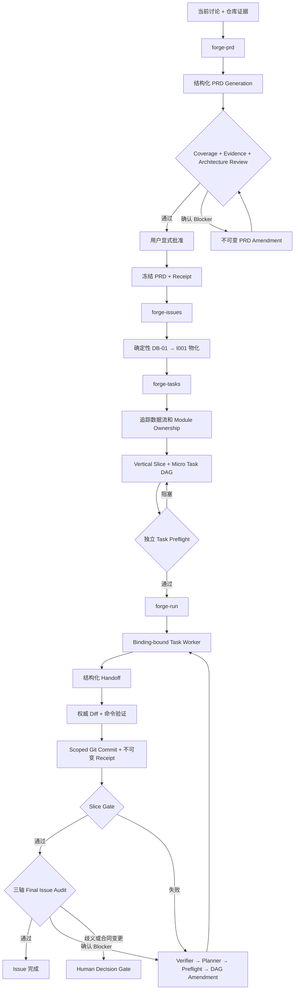

# Pi Forge Workflow

[English README](README.md)

一个面向 [Pi](https://pi.dev) 的确定性、证据驱动工程工作流：把功能讨论转换为经过审查的规划事实、小而可执行的 Task、经过权威验证的 Git Commit、最终 Audit，以及有边界的 Remediation。

> **状态：**实验性 MVP。当前只实现了刻意收敛的 `shared-serial` 执行路径，并在不确定时 Fail-closed。采用前请阅读[当前限制](#当前限制)。

## 为什么需要 Forge？

大型改动经常不是失败在“不会写代码”，而是失败在规划和执行之间：

- PRD、Issue 和 Task 创建过程中需求发生漂移；
- Worker 重新调查仓库，并在执行阶段悄悄重做设计；
- 所谓“小 Task”只是目标摘要，不是可直接执行的合同；
- 把 `Agent completed` 错当成已经验证并交付；
- Retry、Review 和 Remediation 覆盖旧历史；
- 投机性抽象、Fallback 和无关清理不断扩大 Diff。

Forge 把工作流本身视为确定性状态机。LLM 负责提交结构化 Proposal；Runtime 负责校验身份、依赖、Hash、状态转换、Verification、Git Scope 和不可变历史。

## 公开工作流

```text
/skill:forge-init
        ↓
/skill:forge-prd
        ↓
/skill:forge-issues
        ↓
/skill:forge-tasks
        ↓
/skill:forge-run
```

固定规划层级：

```text
PRD → Delivery Boundary → Issue → Vertical Slice → Micro Task
```

- **PRD**：定义完整问题、行为、Acceptance、仓库证据、架构决策和交付边界。
- **Issue**：精确物化一个已经冻结的 Delivery Boundary。
- **Slice**：通过权威 Gate 证明一组可观察的 Issue Acceptance。
- **Micro Task**：一个小型、可独立执行和验证的代码修改包。

## 设计架构



### 权限和职责边界

| 角色 | 职责 | 可以修改产品代码？ |
|---|---|---:|
| Coordinator | 推进确定性 Runtime Frontier | 否 |
| Planner | 生成 PRD、Issue、Slice、Task 或 Remediation Proposal | 否 |
| Reviewer / Auditor | 针对冻结 Review Surface 提交结构化 Finding | 否 |
| Verifier | 独立确认或拒绝 Blocker | 否 |
| Task Worker | 执行一个精确的版本化 Task Contract | 是，但只能修改声明的 Writes |
| Runtime | 校验状态、身份、Hash、DAG、Verification、Git Scope、Receipt 和恢复 | 不适用 |

`Agent completed` 永远不等于 `Task completed`。Task 只有同时满足以下条件才完成：有效 Binding、结构化 Handoff、Worker 终态、权威验证、Scoped Git Commit 和不可变 Receipt。

## 核心设计思路

### 1. PRD 是顶级事实源

没有经过 Review、用户显式批准并 Freeze 的 PRD，就不能创建正式 Issue。PRD 包含：

- 稳定 Acceptance ID；
- Happy、Error、Edge、Omission 和 Compatibility 行为；
- 绑定 Git Revision 的仓库 `path#Symbol` Evidence；
- 架构与 Ownership Decision；
- Test Seam 和 Verification Plan；
- 可独立交付的 `DB-01...` Delivery Boundary；
- 只有在确实能压缩复杂度时才生成的 Mermaid 图。

PRD 接受独立的 **Coverage**、**Evidence** 和 **Architecture** 三轴 Review。Blocker 还要经过独立 Verifier；修订通过新增不可变 Generation 完成，不覆盖旧历史。

### 2. Issue 不能重新设计 PRD

`forge-issues` 确定性映射：

```text
DB-01 → I001
DB-02 → I002
```

Issue 的 Goal、Outcome、Scope、Acceptance、Behavior、Decision、Evidence、Test Seam、Non-goal、Verification 和 Dependency 必须与冻结 Delivery Boundary 一致。Issue 阶段不能扩大 Scope，也不能发明新的实现选择。

### 3. Task 根据真实数据流生成

生成 Task 前，`forge-tasks` 必须关闭完整实现路径：

```text
entry / input boundary
→ normalization / transformation
→ owning Module
→ downstream consumer / side effect
→ observable Test Seam
```

Task 顺序必须由真实 `Produces → Consumes` Artifact 证明。单纯的编码偏好不是 Dependency。Slice 必须是垂直、可观察的行为切片，不能只是“类型”“服务”“测试”这种水平技术分层。

### 4. 小 Worker，详细合同

Worker 只读取自己的版本化合同，例如：

```text
tasks/T003/TASK-V001.md
```

一个 Task 通常只有：

- 一个主要 `path#Symbol` Edit Point；
- 一到两个精确 Reads；
- 一个主要 Write；
- 有序、具体的 Implementation Blueprint；
- 明确的 Produces、Consumes、Out of Scope 和 Acceptance Ownership；
- 聚焦的权威 Verification。

Worker 不读取父 PRD，不重新打开架构决策，不搜索完整调用链，不调用其他 Skill，也不启动嵌套 Subagent。

### 5. Minimal Implementation Policy

每份 Task Contract 固定携带以下政策：

- 优先复用已有 Symbol、Helper、类型、Module 和 Test Seam；
- 只修改冻结 Acceptance 所必需的代码；
- 不增加投机性抽象、依赖、公开 Interface、配置、Feature Flag 或 Extension Point；
- Fallback 默认禁止：没有明确冻结授权和对应 Verification，不允许静默恢复、默认替换、兼容分支、`catch-and-continue` 或吞掉错误；
- 已由可信输入 Seam 或类型建立的内部 Invariant，不重复做运行时校验；
- 不顺手做无关重构、重命名、格式化或清理；
- 保持附近代码的命名、控制流、错误、Import 和测试风格；
- App Entry 和 Composition Root 只负责依赖组装和流程编排；
- 根据内聚职责而不是文件行数拆分，同时避免单函数透传 Module。

### 6. 不可变执行身份

Binding 和 Receipt 保存完整身份：

```text
Work Item / Issue / Task@Version
+ 精确 Task Contract Path
+ Contract Hash
+ DAG Generation
+ Model Policy Generation
+ Git Baseline 和 Commit
```

完成的 Task、Receipt、Commit、Review、Audit 和旧 DAG Generation 永不重写。Remediation 在新的 DAG Generation 中追加新的 `Txxx@V001`。

### 7. 权威 Verification 和 Git 集成

Worker 报告的命令结果只是参考。Coordinator 会重新执行所有冻结 Verification Command，比较真实 Git Diff 和声明 Writes，创建 Scoped Commit，然后写入 Receipt。

Commit Subject 严格使用冻结 Task Title。Forge 的内部 ID 只保存在 Receipt 中，不污染产品 Git History。

### 8. 独立 Audit 和有边界的 Remediation

Slice Gate 全部通过后，Forge 启动三个独立 Final Issue Audit：

- **Standards**；
- **Spec / Integration**；
- **Architecture / Minimality**。

Blocker 进入受控闭环：

```text
Audit Finding
→ 独立 Blocker Verifier
→ 有边界的 Remediation Planner
→ 独立 Task Preflight
→ 追加 DAG Generation
→ Repair Worker
→ 受影响 Slice Gate
→ 新一轮三轴 Audit
```

架构变更、公开 Interface 变更、Scope 变更、证据缺失、不安全仓库操作或无法由仓库事实决定的产品选择，会停在不可变 Human Decision Gate。记录 Answer 和恢复执行是两个分离动作。

## 特性

- 持久化 Work Item Runtime 和 Issue Runtime。
- Atomic State File 与 Append-only Event History。
- 不可变 PRD、Issue、Task Plan、DAG、Review、Audit、Binding 和 Receipt 历史。
- 确定性 DAG 校验和 Frontier 调度。
- 从 PRD 到 Issue、Slice、Task、Gate、Audit 的完整 Acceptance Traceability。
- 通过 `.pi/forge.json` 配置 Model Profile 和 Role Routing。
- Binding-bound `pi-subagents` Worker、Reviewer、Verifier 和 Planner。
- Task Contract Freeze 前的独立 Task Preflight。
- 精确 Task Context 和声明式 Write Boundary。
- 权威 Verification 和 Clean Git Baseline 门禁。
- Scoped 产品 Commit 与不可变执行 Receipt。
- Slice Gate Evidence 与三轴 Final Issue Audit。
- Additive Remediation 和显式 Human Decision Gate。
- 幂等提交，以及对中断生命周期事件的恢复。

## 环境要求

- Node.js `>= 22.19.0`。
- [Pi](https://pi.dev)，并至少配置一个支持 Reasoning 的可用模型。
- [`@tintinweb/pi-subagents`](https://github.com/tintinweb/pi-subagents)，Cross-extension RPC Protocol 版本至少为 v2。
- 目标目录必须是至少有一个 Commit 的 Git Repository。
- Task 执行前 Git Workspace 必须干净。
- 后台 Worker 和 Reviewer 运行时，需要保持一个持久的 Pi Interactive Session。

当前 MVP 只执行：

```text
workspace.mode: shared-serial
isolationBackend: none
poolSize: 1
```

## 安装

### 从 Git 安装

仓库托管后，安装两个 Package：

```bash
pi install npm:@tintinweb/pi-subagents
pi install https://github.com/<owner>/pi-forge-workflow
```

也可以固定 Tag 或 Commit：

```bash
pi install https://github.com/<owner>/pi-forge-workflow@v0.1.0
```

### 从本地 Checkout 安装

```bash
git clone https://github.com/<owner>/pi-forge-workflow.git
cd pi-forge-workflow
npm install
pi install /absolute/path/to/pi-forge-workflow
```

如果希望只安装到当前项目，给 `pi install` 增加 `-l`。

> 当前 `package.json` 仍是 `"private": true` 和版本 `0.0.0`，因此文档推荐 Git 或本地安装，不是 npm 发布。

## 如何使用

从需要 Forge 管理的目标仓库中启动 Pi。

### 1. 配置仓库

```text
/skill:forge-init
```

`forge-init` 会扫描 Git、Package Script、可用模型、Tracker CLI、Repository Instructions、架构和 Context 文档、Agent 目录以及 `pi-subagents`，并在写入前展示完整 Preview。

正常配置会创建或更新：

```text
.pi/forge.json
.pi/subagents.json
.pi/agents/*.md
AGENTS.md 或当前生效的 Pi Context File
.gitignore
```

可以接受推荐配置，也可以逐项调整。显式批准 Preview 后 Apply，然后执行：

```text
/reload
```

### 2. 创建并冻结 PRD

```text
/skill:forge-prd

实现可配置的请求超时，同时保持省略参数时的现有行为。
```

Forge 会吸收当前讨论、记录仓库 Evidence 和开放 Decision、生成 `PRD.md`、启动三轴 Review、在必要时验证 Blocker，并在 Freeze 前要求用户显式批准。

保存返回的 Work Item Root，例如：

```text
.forge/work-items/configurable-request-timeout-a1b2c3d4
```

### 3. 物化 Issue

```text
/skill:forge-issues

Work Item root: .forge/work-items/configurable-request-timeout-a1b2c3d4
```

每个冻结 Delivery Boundary 精确生成一个 Local Issue Artifact。

### 4. 生成 Slice 和 Micro Task

```text
/skill:forge-tasks

Work Item root: .forge/work-items/configurable-request-timeout-a1b2c3d4
Issue: I001
```

Forge 追踪实现数据流，生成 Vertical Slice 和详细 Micro Task，并启动独立 Preflight。只有 Preflight 通过后才初始化 Runtime。

### 5. 执行和恢复

```text
/skill:forge-run

Runtime root: .forge/work-items/configurable-request-timeout-a1b2c3d4/issues/I001/runtime
```

保持 Pi Interactive Session 运行。`forge-run` 每次只推进 Runtime 允许的下一个动作：启动 Worker、完成 Handoff、验证并 Commit Task、运行 Slice Gate、启动 Final Audit，或者进入 Remediation / Human Decision 恢复路径。

## 生成的 Artifact

使用默认 Artifact Root 时，一个 Work Item 类似：

```text
.forge/work-items/<work-item>/
├── PRD.md
├── prd/
│   ├── prd.json
│   └── generations/prd-1.json
├── reviews/
├── receipts/
└── issues/
    ├── manifest.json
    ├── generations/issues-1.json
    └── I001/
        ├── issue.json
        ├── ISSUE.md
        ├── task-preflight/
        ├── task-generations/tasks-1.json
        ├── task-manifest.json
        ├── slices/S001/SLICE.md
        ├── tasks/T001/TASK-V001.md
        └── runtime/
            ├── manifest.json
            ├── dag.json
            ├── generations/
            ├── state.json
            ├── events.jsonl
            ├── bindings/
            ├── receipts/T001-V001.json
            └── audits/
```

Artifact Root 默认为 `.forge`，通常加入 Git Ignore。这里包含机器相关 Runtime 身份、本地路径、Model Routing 和执行证据；除非经过主动清理，否则不要公开上传生成的 Work Item。

## 配置

固定配置路径：

```text
.pi/forge.json
```

`forge-init` 根据当前机器可用模型和目标仓库事实生成配置，主要包含：

- Artifact Root 和 Git Policy；
- Local / GitHub / GitLab Tracker 意图；
- Workspace Policy；
- Model Profile 与 Role Routing；
- PRD Review Assurance 和 Blocker Verification；
- 条件 Option Tournament Policy；
- 权威 Typecheck、Test、Lint 和 Build Command；
- Agent Template 位置；
- Repository Instructions 和 Architecture Context Source。

不要把一台机器生成的 `.pi/forge.json` 复制给另一台机器；应该在每个目标仓库重新运行 `/skill:forge-init`。

## 本地开发

```bash
npm install
npm run typecheck
npm test
```

可选的确定性 Demo：

```bash
npm run demo
npm run demo:prd
```

开发时可以直接加载 Extension：

```bash
pi -e ./extensions/forge-workflow/index.ts
```

在运行中的 Pi Session 修改 Extension 或 Skill 后，执行 `/reload`。

## 当前限制

- 只实现了 `shared-serial + none + poolSize 1` 执行路径。
- GitHub / GitLab Issue 发布 Adapter 尚未实现；Local Issue Artifact 是当前权威事实。
- Issues Amendment 尚未实现。
- Forge-controlled Repository Research Job 和 Option Tournament Orchestrator 尚未实现。如果某项改动必须经过该架构门禁，Forge 应该停止，不能用普通 Subagent 模拟正式 Job。
- 尚无 Forge 专用进度 UI。
- 自动生命周期推进要求 Pi Session 保持运行；一次性 `pi -p` 不适合长期后台执行。
- 由于 `pi-subagents` 尚无更完整的 Status / Resume RPC，恢复依赖 Runtime State 和 Lifecycle Event。
- 项目仍处于 Pre-release，Artifact Schema 可能继续变化。

## 安全模型

Pi Package 使用当前用户权限执行代码。安装前应审查本 Package 及其依赖。

Forge 减少的是工作流歧义，不是操作系统 Sandbox。当前 MVP 直接在目标仓库中以 Shared-serial 模式工作。它会强制 Clean Git Baseline、Declared Writes、Scoped Rollback、Authoritative Verification 和 Fail-closed Human Decision Gate；操作系统层面的隔离仍由使用者负责。
