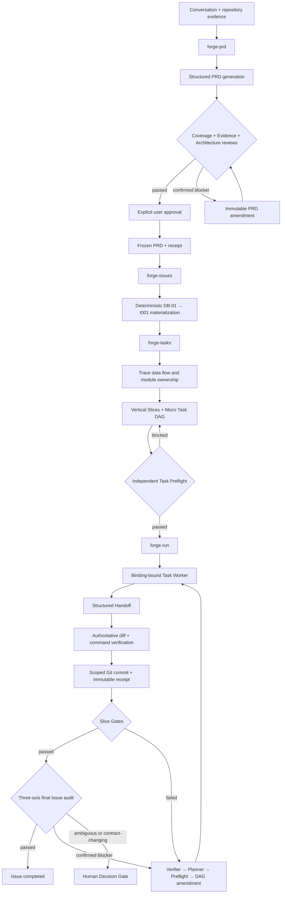

# Pi Forge Workflow

[中文说明](README-CN.md)

A deterministic, evidence-backed engineering workflow for [Pi](https://pi.dev) that turns a feature discussion into reviewed planning artifacts, small executable Tasks, verified Git commits, final audits, and bounded remediation.

> **Status:** experimental MVP. The implemented execution path is intentionally `shared-serial` and fail-closed. See [Current limitations](#current-limitations) before adopting it.

## Why Forge?

Large changes often fail between planning and implementation:

- requirements drift while Issues and Tasks are being created;
- workers rediscover the repository and silently redesign the change;
- “small Tasks” are vague summaries rather than executable contracts;
- agent completion is mistaken for verified delivery;
- retries, reviews, and remediation overwrite history;
- speculative abstractions, fallback behavior, and unrelated cleanup inflate the diff.

Forge treats the workflow itself as a deterministic state machine. The language model proposes structured content, while the Runtime validates identity, dependencies, hashes, state transitions, verification, Git scope, and immutable history.

## Installation

### Install from Git

After this repository is hosted, install both packages:

```bash
pi install npm:@tintinweb/pi-subagents
pi install https://github.com/tlsneo/pi-forge-workflow
```

A tag or commit may be pinned:

```bash
pi install https://github.com/tlsneo/pi-forge-workflow@v0.2.0
```

### Install from a local checkout

```bash
git clone https://github.com/tlsneo/pi-forge-workflow.git
cd pi-forge-workflow
npm install
pi install /absolute/path/to/pi-forge-workflow
```

For project-local Pi installation, add `-l` to `pi install`.

> This repository currently has `"private": true` and version `0.2.0`, so the documented distribution path is Git or a local checkout, not npm publication.

## Public workflow

```text
/skill:forge-init
        ↓
/skill:forge-prd
        ↓
/skill:forge-issues
        ↓
/skill:forge-tasks
        ↓
/skill:forge-run
```

The planning hierarchy is fixed:

```text
PRD → Delivery Boundary → Issue → Vertical Slice → Micro Task
```

- **PRD** defines the complete problem, behavior, Acceptance, evidence, architecture decisions, and delivery boundaries.
- **Issue** materializes exactly one frozen delivery boundary.
- **Slice** proves an observable subset of Issue Acceptance through an authoritative gate.
- **Micro Task** is one small, independently executable and verifiable edit package.

## Architecture



### Authority boundaries

| Role | Responsibility | May edit product code? |
|---|---|---:|
| Coordinator | Advances the deterministic Runtime frontier | No |
| Planner | Produces PRD, Issue, Slice, Task, or remediation proposals | No |
| Reviewer / Auditor | Submits structured findings against a frozen review surface | No |
| Verifier | Independently confirms or rejects Blockers | No |
| Task Worker | Executes one exact versioned Task contract | Yes, within declared Writes only |
| Runtime | Validates state, identity, hashes, DAGs, verification, Git scope, receipts, and recovery | N/A |

`Agent completed` never means `Task completed`. A Task completes only after a valid Binding, structured Handoff, terminal Worker, authoritative verification, scoped Git commit, and immutable Receipt.

## Core design principles

### 1. PRD as the top-level source of truth

A reviewed, explicitly approved, frozen PRD is required before Issues can exist. The PRD contains:

- stable Acceptance IDs;
- happy, error, edge, omission, and compatibility behavior;
- repository `path#Symbol` evidence bound to a Git revision;
- architecture and ownership Decisions;
- Test Seams and verification plans;
- independently deliverable `DB-01...` boundaries;
- optional Mermaid diagrams when they clarify real flow, sequence, state, or relationships.

The PRD receives independent **Coverage**, **Evidence**, and **Architecture** reviews. Blockers are independently verified, and amendments create new immutable generations instead of overwriting history.

### 2. Issues cannot redesign the PRD

`forge-issues` deterministically maps:

```text
DB-01 → I001
DB-02 → I002
```

Goal, outcome, scope, Acceptance, behavior, Decisions, evidence, Test Seams, non-goals, verification, and dependencies must match the frozen Delivery Boundary. The Issue phase cannot widen scope or invent implementation choices.

### 3. Tasks follow real data flow

Before Task generation, `forge-tasks` closes the implementation path:

```text
entry / input boundary
→ normalization or transformation
→ owning Module
→ downstream consumer or side effect
→ observable Test Seam
```

Task ordering must be justified by real `Produces → Consumes` artifacts. Preferred coding order alone is not a dependency. Slices are vertical and observable; they are not horizontal buckets such as “types,” “services,” and “tests.”

### 4. Small workers, detailed contracts

A Worker reads only its versioned contract, for example:

```text
tasks/T003/TASK-V001.md
```

A Task normally has:

- one primary `path#Symbol` edit point;
- one or two exact Reads;
- one primary Write;
- a detailed ordered Implementation Blueprint;
- explicit Produces, Consumes, Out of Scope, and Acceptance ownership;
- focused authoritative verification.

Workers do not read the parent PRD, reopen architecture, search the full call chain, invoke other Skills, or spawn nested Subagents.

### 5. Minimal Implementation Policy

Every Task contract carries a fixed policy:

- reuse existing Symbols, Helpers, types, Modules, and Test Seams;
- change only what frozen Acceptance requires;
- add no speculative abstraction, dependency, public Interface, configuration, feature flag, or extension point;
- treat Fallback as default-deny: no silent recovery, default substitution, compatibility branch, catch-and-continue behavior, or swallowed error without explicit frozen authorization and verification;
- do not repeat runtime validation after a trusted input Seam or type established the invariant;
- do not perform unrelated refactors, renames, formatting, or cleanup;
- preserve nearby naming, control-flow, error, import, and test conventions;
- keep app entry points and Composition Roots limited to wiring and orchestration;
- split by coherent responsibility, not line count, while avoiding one-function pass-through Modules.

### 6. Immutable execution identity

Bindings and Receipts include the full identity:

```text
Work Item / Issue / Task@Version
+ exact Task contract path
+ contract hash
+ DAG generation
+ model policy generation
+ Git baseline and commit
```

Completed Tasks, Receipts, commits, reviews, audits, and old DAG generations are never rewritten. Remediation appends new `Txxx@V001` Tasks in a new DAG generation.

### 7. Authoritative verification and Git integration

Worker-reported commands are advisory. The coordinator reruns every frozen verification command, compares the actual Git diff against declared Writes, creates a scoped commit, and then writes the Receipt.

Commit subjects are exactly the frozen Task titles. Forge metadata remains in Receipts rather than leaking into product-facing Git history.

### 8. Independent audit and bounded remediation

After Slice Gates pass, Forge runs three independent final Issue audits:

- **Standards**;
- **Spec / Integration**;
- **Architecture / Minimality**.

A Blocker enters a controlled loop:

```text
Audit Finding
→ independent Blocker Verifier
→ bounded Remediation Planner
→ independent Task Preflight
→ additive DAG generation
→ repair Worker
→ affected Slice Gates
→ fresh three-axis audit
```

Architecture changes, public Interface changes, scope changes, missing evidence, unsafe repository operations, or unresolved product choices stop at an immutable Human Decision Gate. Recording an answer and resuming execution are separate actions.

## Features

- Persistent Work Item and Issue Runtime state.
- Atomic state files plus append-only events.
- Immutable PRD, Issue, Task Plan, DAG, Review, Audit, Binding, and Receipt history.
- Deterministic DAG validation and frontier scheduling.
- Full Acceptance traceability from PRD to Issue, Slice, Task, Gate, and Audit.
- Model profiles and role-based routing through `.pi/forge.json`.
- Binding-bound `pi-subagents` Workers, Reviewers, Verifiers, and Planners.
- Independent Task Preflight before Task contracts are frozen.
- Exact Task context and declared Write boundaries.
- Authoritative verification and clean Git baseline enforcement.
- Scoped product-facing commits with immutable execution Receipts.
- Slice Gate evidence and final three-axis Issue audit.
- Additive remediation and explicit Human Decision gates.
- Idempotent submissions and recovery from interrupted lifecycle events.

## Requirements

- Node.js `>= 22.19.0`.
- [Pi](https://pi.dev) with at least one available reasoning-capable model.
- [`@tintinweb/pi-subagents`](https://github.com/tintinweb/pi-subagents) with Cross-extension RPC protocol v2.
- A target Git repository with at least one commit.
- A clean Git workspace before Task execution.
- A persistent interactive Pi session while background Workers and Reviewers are running.

The current MVP executes only:

```text
workspace.mode: shared-serial
isolationBackend: none
poolSize: 1
```

## Usage

Run Pi from the repository you want Forge to manage.

### 1. Configure the repository

```text
/skill:forge-init
```

`forge-init` scans Git, package scripts, available models, tracker CLIs, repository instructions, architecture/context documents, Agent directories, and `pi-subagents`. It previews all changes before writing.

The normal setup creates or updates:

```text
.pi/forge.json
.pi/subagents.json
.pi/agents/*.md
AGENTS.md or the active Pi context file
.gitignore
```

Accept the recommended configuration or review each section. Explicitly approve the preview before Apply, then run:

```text
/reload
```

### 2. Create and freeze the PRD

```text
/skill:forge-prd

Build configurable request timeouts while preserving omission behavior.
```

Forge synthesizes the conversation, records repository evidence and open decisions, generates `PRD.md`, starts the three review axes, verifies Blockers when necessary, and asks for explicit approval before Freeze.

Keep the returned Work Item root, for example:

```text
.forge/work-items/configurable-request-timeout-a1b2c3d4
```

### 3. Materialize Issues

```text
/skill:forge-issues

Work Item root: .forge/work-items/configurable-request-timeout-a1b2c3d4
```

Every frozen Delivery Boundary becomes exactly one Local Issue artifact.

### 4. Generate Slices and Micro Tasks

```text
/skill:forge-tasks

Work Item root: .forge/work-items/configurable-request-timeout-a1b2c3d4
Issue: I001
```

Forge traces the implementation flow, creates vertical Slices and detailed Micro Tasks, and starts an independent Preflight. The Runtime is initialized only after Preflight passes.

### 5. Execute and recover

```text
/skill:forge-run

Runtime root: .forge/work-items/configurable-request-timeout-a1b2c3d4/issues/I001/runtime
```

Keep the interactive Pi session open. `forge-run` advances only the next deterministic action: start a Worker, finalize a Handoff, verify and commit a Task, run a Slice Gate, start final Audits, or enter remediation/human-decision recovery.

## Generated artifacts

With the default artifact root, a Work Item resembles:

```text
.forge/work-items/<work-item>/
├── PRD.md
├── prd/
│   ├── prd.json
│   └── generations/prd-1.json
├── reviews/
├── receipts/
└── issues/
    ├── manifest.json
    ├── generations/issues-1.json
    └── I001/
        ├── issue.json
        ├── ISSUE.md
        ├── task-preflight/
        ├── task-generations/tasks-1.json
        ├── task-manifest.json
        ├── slices/S001/SLICE.md
        ├── tasks/T001/TASK-V001.md
        └── runtime/
            ├── manifest.json
            ├── dag.json
            ├── generations/
            ├── state.json
            ├── events.jsonl
            ├── bindings/
            ├── receipts/T001-V001.json
            └── audits/
```

The artifact root defaults to `.forge` and is normally Git-ignored. It contains machine-specific Runtime identity, local paths, model routing, and execution evidence; do not publish generated Work Items unless intentionally sanitized.

## Configuration

The fixed configuration path is:

```text
.pi/forge.json
```

`forge-init` generates it from the models and repository facts available on the user's machine. Major sections include:

- artifact root and Git policy;
- Local/GitHub/GitLab tracker intent;
- workspace policy;
- model profiles and role routing;
- PRD review assurance and Blocker verification;
- conditional Option Tournament policy;
- authoritative typecheck, test, lint, and build commands;
- Agent template location;
- repository instructions and architecture context sources.

Do not copy another machine's generated `.pi/forge.json`; run `/skill:forge-init` in each target repository.

## Development

```bash
npm install
npm run typecheck
npm test
```

Optional deterministic demos:

```bash
npm run demo
npm run demo:prd
```

Load the Extension directly during development:

```bash
pi -e ./extensions/forge-workflow/index.ts
```

After changing Extension or Skill files in a running Pi session, use `/reload`.

## Current limitations

- Only the `shared-serial + none + poolSize 1` execution path is implemented.
- GitHub/GitLab Issue publication adapters are not implemented; Local Issue artifacts are authoritative.
- Issues Amendment is not implemented.
- Forge-controlled Repository Research Jobs and Option Tournament orchestration are not implemented. If a change requires that architecture gate, Forge must stop rather than simulate it with generic Subagents.
- There is no Forge-specific progress UI.
- Automatic lifecycle continuation requires a live Pi session; a one-shot `pi -p` process is unsuitable for long-running background execution.
- Recovery relies on Runtime state and lifecycle events because richer `pi-subagents` status/resume RPC is not yet available.
- The project is pre-release and its artifact schemas may still change.

## Security model

Pi Packages execute code with the user's permissions. Review this package and its dependencies before installation.

Forge reduces workflow ambiguity, but it is not a sandbox. The current MVP intentionally uses the target repository directly in shared-serial mode. It enforces clean Git baselines, declared Writes, scoped rollback, authoritative verification, and fail-closed Human Decision gates; operating-system isolation remains the user's responsibility.
